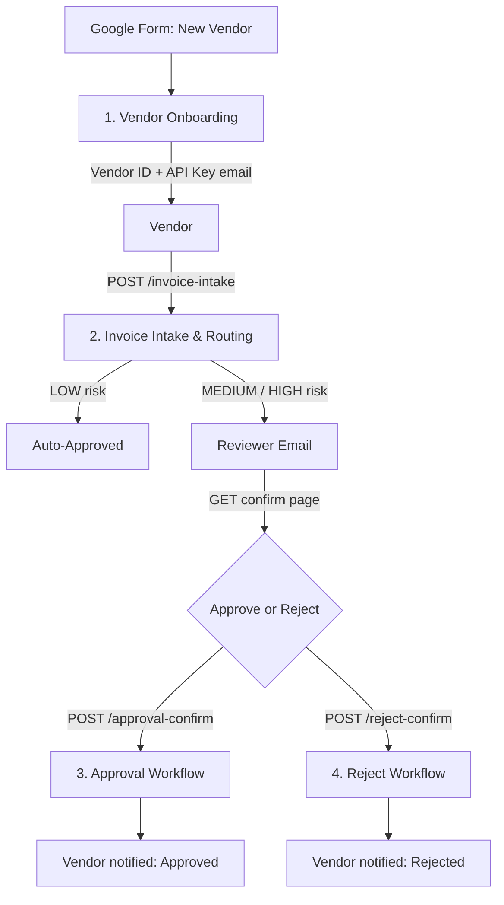
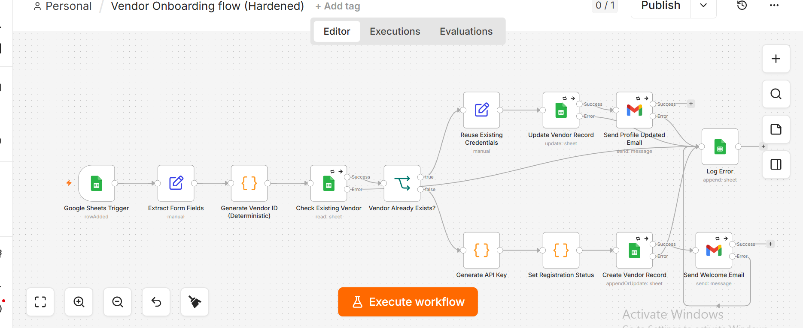
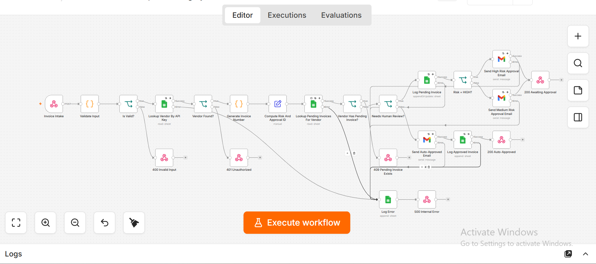
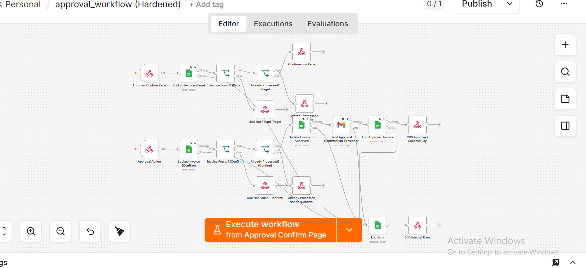
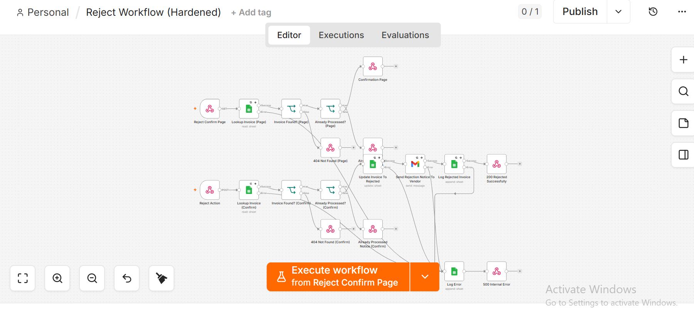

# Vendor Invoice Intake & Approval Automation

An n8n automation system that lets vendors self-register, submit invoices via API,
and get routed through risk-based approval — with no manual data entry on the
finance team's side.

Built and hardened as a portfolio piece to demonstrate production-grade n8n
workflow design: input validation, idempotency, error handling, and secure
action links, not just a happy-path demo.


---

## What it does

1. A vendor fills out a Google Form → **Vendor Onboarding** issues them a
   unique vendor ID and API key by email.
2. The vendor's system (or a manual client) POSTs an invoice to a webhook
   using that API key → **Invoice Intake & Routing** validates it, scores it
   by risk, and either auto-approves it or routes it to a human reviewer.
3. A reviewer clicks Approve or Reject in their email → a confirmation page
   loads (no action taken yet) → they confirm → **Approval** or **Reject**
   updates the record and notifies the vendor.

## Project structure

```
vendor-invoice-automation/
├── README.md
├── LICENSE
├── .gitignore
├── .env.example
└── workflows/
    ├── 1-vendor-onboarding.json
    ├── 2-invoice-intake-and-routing.json
    ├── 3-approval-workflow.json
    └── 4-reject-workflow.json
```

## Architecture



## Workflows

| # | File | Trigger | Responsibility |
|---|------|---------|-----------------|
| 1 | `workflows/1-vendor-onboarding.json` | Google Sheets poll (new form row) | Issues a deterministic vendor ID + API key; safely re-runs on edits without duplicating vendors or reissuing credentials |
| 2 | `workflows/2-invoice-intake-and-routing.json` | Webhook `POST /invoice-intake` | Validates input, authenticates by API key, scores risk (LOW/MEDIUM/HIGH), auto-approves or routes to review |
| 3 | `workflows/3-approval-workflow.json` | Webhook `GET /approval`, `POST /approval-confirm` | Renders a confirmation page, then applies the approval on explicit confirmation |
| 4 | `workflows/4-reject-workflow.json` | Webhook `GET /reject`, `POST /reject-confirm` | Same pattern as above, for rejection |

## Screenshots

**1. Vendor Onboarding** — deterministic ID generation, existing-vendor
reuse path, and the error-logging branch:



**2. Invoice Intake & Risk Routing** — validation, vendor lookup, risk
scoring, and the LOW/MEDIUM/HIGH branch into auto-approval or reviewer
email:



**3. Approval Workflow** — the GET-render / POST-confirm split and the
already-processed guard:



**4. Reject Workflow** — same hardened pattern applied to rejection:



## Engineering highlights

This system went through a deliberate audit-and-harden pass before being
published. A few things worth pointing out to anyone reviewing the code:

- **Idempotent by design.** Vendor IDs are deterministically derived, so a
  re-submitted form row updates the existing vendor instead of minting a
  duplicate identity and orphaning the original API key.
- **Duplicate-submission guard scoped correctly.** A vendor is blocked from
  submitting a second invoice only while a prior one is still `pending` —
  not permanently after their first submission.
- **No unauthenticated state-changing links.** Approve/Reject email links are
  `GET` requests that only render a confirmation page. The actual state
  change requires an explicit `POST`, which prevents email security scanners
  from silently auto-approving or auto-rejecting invoices by prefetching the
  link.
- **Idempotency guard on approval actions.** Re-clicking a stale link (or a
  duplicate webhook delivery) checks the current status first and returns
  "already processed" instead of double-emailing or double-logging.
- **Consistent error handling.** Every Google Sheets and Gmail call has retry
  logic and a dedicated error branch that logs the failure and returns a
  proper error response, instead of the workflow silently dying mid-run.
- **Real input validation.** Currency is checked against an allow-list;
  amount is validated as a finite, positive, sane-range number — not just
  "field is present."

## Setup

### Prerequisites

- A self-hosted or cloud n8n instance (tested against n8n 1.x)
- A Google account with Sheets + Gmail OAuth2 credentials configured in n8n
- Four Google Sheets: Vendor Database, Invoices, Approved Invoices, Reject
  Invoices (schemas below), plus an Errors log sheet
- A public URL for your n8n instance (e.g. a Cloudflare Tunnel, ngrok, or a
  deployed instance) if vendors or reviewers need to reach it outside your
  local network

### 1. Import the workflows

In n8n: **Workflows → Add Workflow → Import from File**, and import each of
the four files in `workflows/` in order. Reconnect your Google Sheets and
Gmail credentials on each imported workflow (credential references don't
carry over between n8n instances).

### 2. Set environment variables

| Variable | Purpose | Example |
|---|---|---|
| `APPROVER_EMAIL` | Where risk-review and auto-approval notifications are sent | `finance@yourcompany.com` |
| `BASE_URL` | Public base URL used in emailed links and API instructions | `https://your-tunnel-url.com` |

### 3. Google Sheets schema

Create each sheet with these exact column headers (case-sensitive, used
directly by the workflows):

**Vendor Database**
`vendor_id, vendor_name, vendor_api_key, contact_no, email, status, bank_name, account_name, account_no, vendor_category, registration_date`

**Invoices**
`vendor_id, invoice_number, amount, currency, status, approval_id, risk_level`

**Approved Invoices**
`vendor_id, invoice_number, amount, currency, status, timestamp`

**Reject Invoices**
`vendor_id, invoice_number, amount, currency, status, timestamp`

**Errors**
`workflow, node, timestamp, input_payload, error_message`

Every Google Sheets node ships with a placeholder document ID — nothing will
work until you point these at your own sheets. In each workflow file, find
and replace:

| Placeholder | Replace with |
|---|---|
| `REPLACE_WITH_VENDOR_DATABASE_SHEET_ID` | Your Vendor Database sheet's ID |
| `REPLACE_WITH_INVOICES_SHEET_ID` | Your Invoices sheet's ID |
| `REPLACE_WITH_APPROVED_INVOICES_SHEET_ID` | Your Approved Invoices sheet's ID |
| `REPLACE_WITH_REJECT_INVOICES_SHEET_ID` | Your Reject Invoices sheet's ID |
| `REPLACE_WITH_ERROR_LOG_SHEET_ID` | Your Errors log sheet's ID |

Easiest way: open each JSON file in a text editor and do a find/replace
before importing, or import first and re-select the correct sheet from the
dropdown on each Google Sheets node inside n8n (the "Errors" node in each
workflow needs this too — it's the easiest one to forget).

A Google Sheet's ID is the long string in its URL:
`https://docs.google.com/spreadsheets/d/`**`THIS_PART`**`/edit`

### 4. Activate

Activate all four workflows in n8n. Test with the stress-test cases below
before treating this as production-ready for a real client.

## Suggested test cases before demoing or deploying

- Submit a valid low-risk invoice → confirm it auto-approves and returns 200.
- Submit a second invoice from the same vendor while the first is still
  pending → confirm you get a 409, not a silent failure.
- Submit a medium-risk invoice → confirm the reviewer email arrives and the
  confirm-page/confirm-action flow completes without a node error.
- Click an approval link twice → confirm the second click returns
  "already processed" rather than double-updating the sheet.
- Submit an invoice with an invalid currency or a negative amount → confirm
  a specific 400 error, not a generic failure.

## Known limitations

- **API keys are stored in plaintext** in the Vendor Database sheet. Hashing
  them requires Node's `crypto` module, which most self-hosted n8n instances
  disable by default (`NODE_FUNCTION_ALLOW_BUILTIN`). Left out to avoid
  shipping something that silently breaks on a stock install — flagged here
  rather than glossed over.
- **No dashboard for non-technical monitoring.** A client-facing status view
  would sit on top of the four sheets rather than n8n's execution log.
- **Single-currency risk thresholds.** Risk tiers are based on raw amount
  regardless of currency; a proper version would normalize to a base
  currency before scoring.

## Tech stack

n8n · Google Sheets API · Gmail API · JavaScript (Code nodes)

## License

MIT — see [LICENSE](LICENSE).
